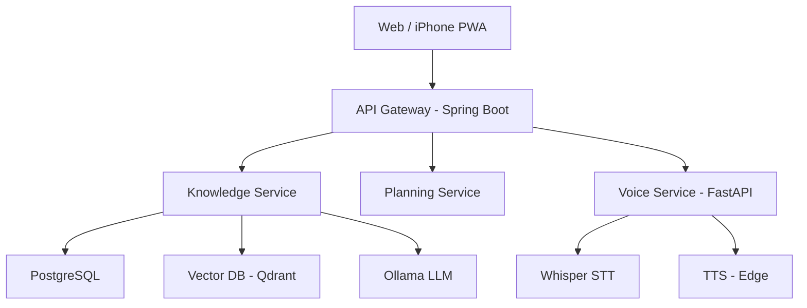
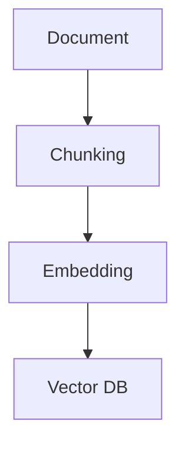
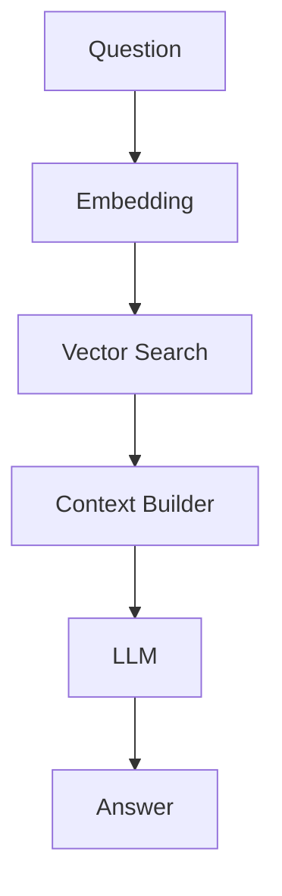
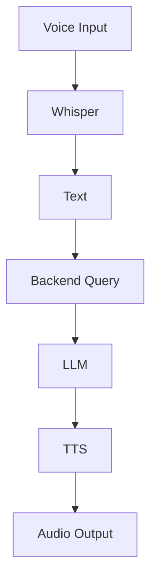

# 🧠 KB-AI SYSTEM — MASTER BLUEPRINT

---

# 1. 🎯 SYSTEM VISION

> Build a **Personal AI Brain** that:

* Stores knowledge (coding, trading, ideas)
* Understands context
* Supports thinking & decision-making
* Works via Web + Mobile + Voice

---

# 2. 🏗️ SYSTEM ARCHITECTURE



---

# 3. 🧩 CORE MODULES

## 3.1 Knowledge Base

* Document storage
* Chunking
* Embedding
* Retrieval (RAG)

---

## 3.2 AI Engine

* Prompt builder
* Context injection
* Answer generation

---

## 3.3 Planning System

* Task management
* Priority
* Deadline

---

## 3.4 Voice System

* Speech → Text
* AI processing
* Text → Speech (Vietnamese female)

---

# 4. 🧠 RAG PIPELINE

## Ingestion



---

## Query



---

# 5. 🗄️ DATABASE STRATEGY

## 5.1 Multi-layer DB

* PostgreSQL → core data
* Qdrant → vector search
* Redis → cache (optional)
* Graph DB → relationships (future)

---

## 5.2 Core Tables

### documents

```sql
id UUID
title TEXT
content TEXT
type VARCHAR
created_at TIMESTAMP
```

---

### document_chunks

```sql
id UUID
document_id UUID
chunk_text TEXT
chunk_index INT
```

---

### tasks

```sql
id UUID
title TEXT
status VARCHAR
priority VARCHAR
deadline TIMESTAMP
```

---

### ai_queries

```sql
id UUID
question TEXT
answer TEXT
latency INT
```

---

### feedback

```sql
id UUID
query_id UUID
rating INT
```

---

# 6. 🧠 DATA MODEL (CRITICAL)

## Coding Note

```json
{
  "type": "coding",
  "language": "java",
  "topic": "spring boot"
}
```

---

## Trading Log

```json
{
  "type": "trading",
  "symbol": "BTC",
  "entry": 60000,
  "exit": 62000,
  "strategy": "RSI"
}
```

---

## Insight

```json
{
  "type": "insight",
  "content": "I tend to FOMO..."
}
```

---

# 7. 🔥 AI LAYERS

## 7.1 Retrieval AI

* Vector search
* Context fetch

---

## 7.2 Processing AI

* Summarization
* Tagging
* Linking

---

## 7.3 Agent AI (Future)

* Suggest ideas
* Detect patterns
* Support decisions

---

# 8. 🎤 VOICE PIPELINE



---

# 9. 📱 WEB + IPHONE STRATEGY

## PWA Approach

* Build web app
* Add to iPhone Home Screen
* Use like native app

---

## Advantages

* Single codebase
* No App Store needed
* Fast iteration

---

# 10. ⚙️ EXECUTION ROADMAP

---

## PHASE 1 — MVP

* [ ] Upload document
* [ ] Chunking + embedding
* [ ] Query RAG
* [ ] Basic UI

---

## PHASE 2 — IMPROVE AI

* [ ] Prompt optimization
* [ ] Metadata filtering
* [ ] Re-ranking

---

## PHASE 3 — FEATURES

* [ ] Planning system
* [ ] Voice assistant
* [ ] Auto summary

---

## PHASE 4 — ADVANCED

* [ ] Knowledge graph
* [ ] Insight engine
* [ ] Pattern detection

---

# 11. ⚠️ RISKS

* Bad chunking → AI useless
* No metadata → search fail
* No feedback → no learning
* Overbuild too early

---

# 12. 🎯 FINAL STRATEGY

## Build order:

1. RAG (must work well)
2. Data structure
3. Simple UI
4. Voice
5. Insight system

---

# 🔥 FINAL MESSAGE

> This is not just an app.
> This is a system that extends your thinking.

---
